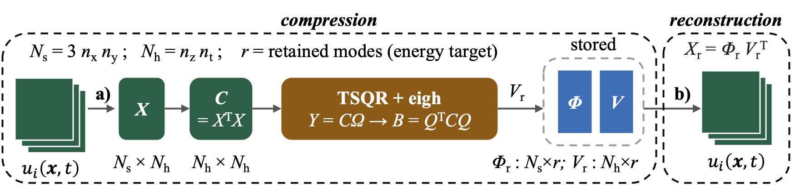
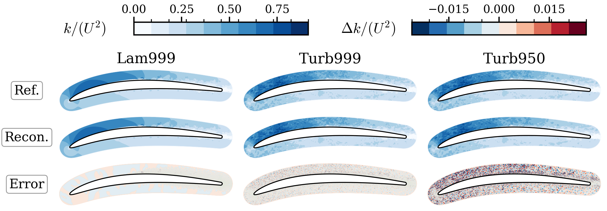

# Turbulent kinetic energy budget-oriented compression of high-fidelity flow data
<!-- TODO: update the repository name/title above and the DOI badge below once the Zenodo record is minted. -->

[](https://doi.org/10.5281/zenodo.XXXXXXXX)
[](https://opensource.org/licenses/MIT)

This repository contains the computational framework presented in the manuscript currently under review on the GPU-accelerated compression, or reduced-order representation, of large turbulent-flow datasets via Proper Orthogonal Decomposition (POD).

This public repository provides the reduced workflow used for the present study, including the GPU-enabled Dask implementation for the snapshot-POD compression, a reduced public test case, example outputs, and a reconstruction-error check.

## Algorithm

<p align="center">
  
</p>

The snapshots `u_i(x, t)` are arranged into the fluctuation matrix `X` of size `N_s x N_h`, with `N_s = 3 n_x n_y` (the three velocity components over the non-homogeneous plane) and `N_h = n_z n_t` (the spanwise-homogeneous direction folded together with the snapshots). The temporal correlation matrix `C = X^T X` is factorised with a randomized eigensolver: a tall-skinny QR of `Y = C Ω` yields an orthonormal basis `Q`, the small matrix `B = Q^T C Q` is diagonalised with `eigh`, and the `r` leading modes needed to reach the energy target are retained. Only the reduced spatial modes `Φ_r` (`N_s x r`) and the reduced temporal eigenvectors `V_r` (`N_h x r`) are stored; any snapshot is recovered as `X_r = Φ_r V_r^T`.

## Repository structure

- `hpda/`: Python source files for the four workflow stages and the associated helper functions.
- `submission/`: example SLURM submission scripts and a driver that submits the four stages in sequence.
- `FLOW/`: input-data directory for the workflow. It contains the sequence file used by the reduced public test case. The full set of raw flow snapshots and the grid are not stored directly in this GitHub repository because of their size, and can be retrieved from Zenodo (see `FLOW/README.md`).
- `STATS/`: output-data directory for the workflow. It holds the compressed representation (reduced modes, eigenvectors, means) and the reconstruction-check results. Some large files can be retrieved from Zenodo (see `STATS/README.md`).

## Workflow overview

The compression workflow follows four stages, each mapped to one Python script and one SLURM submission script:

1. **Read and correlation matrix** (`1_RED_dask_read_POD.py`, `J1_RED_read_GPU.sh`).
   The raw snapshots are read and the velocity components `u, v, w` are assembled into a fluctuation matrix `X = [u; v; w]` after removing the temporal mean. The temporal correlation matrix `C = X^T X` is then computed (method of snapshots) and written to disk in HDF5 chunks together with `C_metadata.json`. The mean fields are saved in Parquet format.

2. **Eigendecomposition** (`2_Comp_Eig.py`, `J2_gpu_comp.sh`).
   A randomized GPU eigensolver decomposes `C`, the cumulative energy content is evaluated, and the number of modes `k` required to reach the target energy is selected. The reduced temporal eigenvectors `V` are written by rows in HDF5, and the number of modes retained for several energy targets is stored in `k_per_target.json`.

3. **Reduced spatial modes / compression** (`3_RED_write_GPU.py`, `J3_gpu_phi_comp.sh`).
   The fluctuation fields are recomputed, the reduced eigenvectors `V` are loaded, and the reduced spatial modes `Phi = X . V` are formed block-wise on the GPUs. The blocks `phi_{u,v,w}` are written to disk together with `EV_metadata.json`. The pair `(Phi, V)`, together with the mean fields, is the compressed representation of the dataset.

4. **Reconstruction check** (`4_check_RED.py`, `J4_gpu_check.sh`).
   A set of selected snapshots is reconstructed as `Phi . V^T + mean` and compared against the original snapshots. The relative reconstruction error per snapshot, and the minimum/maximum differences, are reported in the job log.

The submission scripts in `submission/` show how these four stages can be run sequentially on an HPC system.

## Reduced public test case

The repository includes a reduced public test case designed to reproduce the workflow on a much smaller dataset than the original production case.

The `FLOW/` directory mirrors the input-data structure used by the workflow. The sequence file required by the reduced case is provided in the repository; the raw snapshots and grid are distributed separately through Zenodo because of their size (see `FLOW/README.md`).

The `STATS/` directory mirrors the output-data structure used by the workflow and is populated with the compressed outputs when the pipeline is run (see `STATS/README.md`).

## Installation on an HPC system

The workflow was developed and tested in a module-based HPC environment using Anaconda, Dask and CuPy. The GPU stages require a Python environment with CUDA-aware packages.

A representative environment setup is:

1. Load the system modules required by the cluster:

    ```bash
    module purge
    module load openmpi
    module load nvhpc
    module load cuda
    module load anaconda3/2022.05
    ```

2. Initialize Conda in the shell:

    ```bash
    source $(conda info --base)/etc/profile.d/conda.sh
    eval "$(conda shell.bash hook)"
    ```

3. Create and activate a dedicated environment:

    ```bash
    conda create --yes --prefix $HOME/.conda-envs/ghpda -c conda-forge --override-channels python=3.9
    conda activate $HOME/.conda-envs/ghpda
    ```

4. Install the required packages:

    ```bash
    conda install --yes -c conda-forge --override-channels \
        dask distributed dask-jobqueue dask-cuda \
        cupy cuda-cudart cuda-version=12 \
        numpy scipy pandas pyarrow h5py threadpoolctl
    ```

This is a cleaned version of the environment used for the GPU workflow. Cluster-specific details such as account names, partitions, module names and the conda environment prefix must be adapted by the user. The submission scripts use the placeholders `YOUR_ACCOUNT`, `YOUR_PARTITION` and `YOUR_GPU_CONDA_ENV` for exactly these values.

## Running the reduced workflow

The scripts in `submission/` illustrate the intended execution order. Edit the paths and node counts at the top of `run_comp_pipeline.sh`, then submit the whole chain from the `submission/` directory:

```bash
cd submission
bash run_comp_pipeline.sh
```

The driver exports the input/output locations and the number of snapshots, then submits the four stages with SLURM `afterok` dependencies so that each stage starts only if the previous one succeeded. The individual stages can also be submitted manually in the same order.

The directory structure expected by the scripts (input in `FLOW/`, output in `STATS/`) is already reflected in this repository.

## Outputs

Running the pipeline produces, in the output directory:

- `mean_{u,v,w}_<block>.parquet` — temporal mean fields,
- `C_matrix_r*_c*.h5`, `C_metadata.json` — the temporal correlation matrix, stored by chunks,
- `V_rows_*.h5` — the reduced temporal eigenvectors,
- `phi_{u,v,w}_a*_b*.npy`, `EV_metadata.json` — the reduced spatial modes (compressed output),
- `k_per_target.json` — number of modes retained for each energy target,
- reconstruction errors for the selected snapshots, reported in the stage-4 job log.

## Example: reconstructed flow fields

<p align="center">
  
</p>

Turbulent kinetic energy `k/(rho U^3)` on the blade for three representative cases (`Lam999`, `Turb999`, `Turb950`, where the label combines the inlet condition with the retained-energy target). Each column compares the reference field (top), the field reconstructed from the compressed representation (middle), and the pointwise error `Δk/(rho U^3)` (bottom). The reconstruction stays close to the reference even at the more aggressive energy targets, with the residual error concentrated in the smallest turbulent scales.

## Citation

If you use this repository, please cite the archived Zenodo release:

<!-- TODO: insert the title, year and Zenodo DOI once the record is minted. -->

> Lopes, G., Henningson, D., & Lengani, D. (2026). *MSCA-COMPOSE/GPU-framework-for-turbulent-flow-compression: v1.0.0* (v1.0.0). Zenodo. [https://doi.org/10.5281/zenodo.XXXXXXXX](https://doi.org/10.5281/zenodo.XXXXXXXX)

**DOI**: [10.5281/zenodo.XXXXXXXX](https://doi.org/10.5281/zenodo.XXXXXXXX)

The scientific context, methodology, and discussion of results are described in the associated manuscript:

> Lopes, G., Henningson, D., & Lengani, D. *Title of the compression manuscript.* Submitted to *Journal name* (under review), 2026.

This entry will be updated with the journal reference and DOI upon acceptance.

## License

This repository is distributed under the MIT License.
